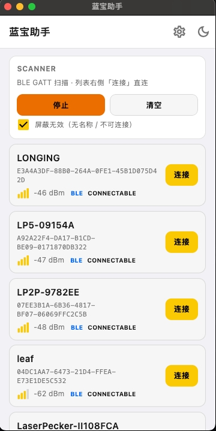
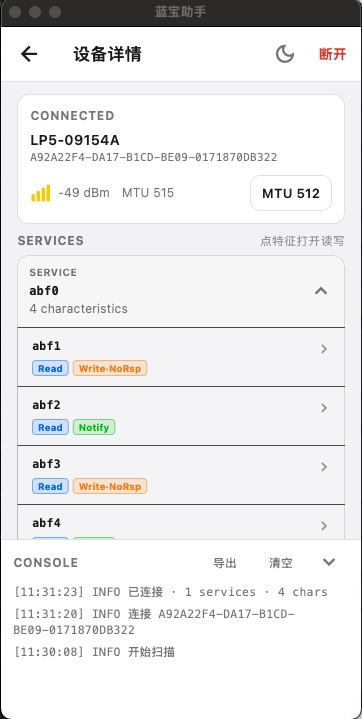

# 蓝宝助手 / BlueStack

Bluetooth debug tool (Flutter). First version is for local use only — not for App Store / Play Store release.

## Screenshots

扫描列表 · 设备详情




## Prerequisites

- Flutter SDK with constraint `>=3.32.0` (local install used for this repo: 3.44.5 stable).
- This machine must have LaserPecker Flutter sources at:

  `/Users/feixiang/Desktop/work/laserpecker-flutter`

- Feasy Bluetooth SDK is a **path dependency** pointing at:

  `../../work/laserpecker-flutter/lp_plugins/feasy_blue_sdk`

  relative to this `BlueApp` folder. If that path is missing, `flutter pub get` / builds will fail. Do not vendor-copy the SDK jars/so into this repo.

## Run

From this directory:

```bash
cd BlueApp
flutter pub get
flutter test
```

Pick a connected device (or simulator where Bluetooth is unavailable — use a physical device for manual checks below):

```bash
# Android phone / emulator with Bluetooth
flutter run -d android

# iOS device (recommended; simulator has no real BLE)
flutter run -d ios

# macOS desktop
flutter run -d macos
```

List targets: `flutter devices`.

## 打包

产物目录：`dist/<version>/`（不进 git）。

```bash
# 只打 Android APK
./scripts/build_android.sh

# 只打 iOS IPA（需 macOS + Xcode 签名，Team 76BA555MU3）
./scripts/build_ios.sh

# 一次打两个包
./scripts/build_all.sh
```

iOS 默认 `development` 导出。改 ad-hoc / App Store：

```bash
IOS_EXPORT_METHOD=ad-hoc ./scripts/build_ios.sh
```

Android 正式包用 `scripts/lanbao-release.jks` 签名，口令在 `scripts/key.properties`（都不进 git，请自行备份）。

## Manual pass checklist (hardware)

Automated tests cover logic without real radios. **The steps below are for an operator on physical hardware** — check each box only after you verify on device. Do not treat unchecked items as done.

### Android

- [ ] **GATT (Feasy off, 低功耗):** Scan, connect a BLE peripheral, open the GATT tree, read a characteristic, write a characteristic, enable Notify — TX/RX bytes appear in the log.
- [ ] **Classic SPP (Feasy off, 经典):** Scan and connect an HC-05 or equivalent classic module; send and receive bytes in the serial console.
- [ ] **Feasy:** Turn on **使用 Feasy 链路**; scan finds an LP module; connect; CONSOLE shows TX/RX bytes.

### iOS

- [ ] **GATT (Feasy off):** Scan, connect, read / write / Notify on GATT characteristics; log shows bytes.
- [ ] **Feasy:** Turn on **使用 Feasy 链路**; connect to an LP module; CONSOLE shows bytes.
- [ ] **No classic:** Confirm the scan page has **no** 「低功耗 / 经典」 segment (classic Bluetooth is Android-only).

### macOS

- [ ] **GATT only:** Scan and connect a BLE peripheral; exercise read / write / Notify via the GATT tree.
- [ ] **Feasy disabled:** **使用 Feasy 链路** must not stay on — toggle off immediately or show Toast `Feasy 仅手机可用` with the switch snapping back (Feasy is phone-only).
